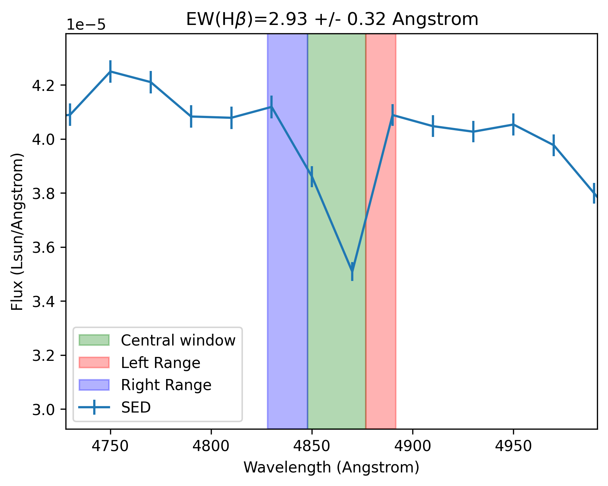

.. _user_guide:

=====================
User Guide
=====================

This guide covers the detailed usage of PST for varius tasks. For practical cases, see the :ref:`tutorials <tutorials>` section.

Simple Stellar Population (SSP) Models
======================================

**Simple Stellar Population (SSP)** models are an essential tool in understanding the evolution and properties of stellar systems. An SSP represents a group of stars formed at the same time with the same initial chemical composition. By assuming a single age and metallicity, SSPs provide a framework for modeling how these populations evolve over time and allow the synthesis of observables, such as spectra and photometry.

In this section, we'll dive into the SSP models implemented in PST, explore their attributes, and highlight the features that this module provides for astrophysical modeling.

The class :class:`pst.SSP.SSPBase` is the backbone of the SSP models in PST. It provides a flexible and efficient way to represent the spectral energy distributions (SEDs) of stellar populations across a grid of ages and metallicities.

Key Attributes
^^^^^^^^^^^^^^

- **ages** (:class:`astropy.units.Quantity`): An array of SSP ages, representing different stages of stellar evolution.
- **metallicities** (:class:`astropy.units.Quantity`): The metallicity values (fraction of elements heavier than helium) for the SSPs.
- **L_lambda** (:class:`astropy.units.Quantity`): The spectral energy distributions (SEDs) of the SSPs. This 3D array holds data for each combination of metallicity, age, and wavelength.
- **wavelength** (:class:`astropy.units.Quantity`): The wavelength array associated with the SEDs of the SSPs, allowing the user to model the flux over a range of wavelengths.

Features
^^^^^^^^

PST provides a number of features to work with SSP models, allowing users to manipulate and extract various physical and observational quantities:

.. code-block:: python

            from pst.SSP import PopStar
            from astropy import units as u
            ssp_model = PopStar(IMF='cha')

- **SSP Interpolation**
   The `get_weights` method provides a 2D interpolation tool that allows you to compute weights for a given set of ages and metallicities. This method is useful for handling multiple stellar populations simultaneously, especially in galaxy synthesis models where stars form over a range of ages and metallicities.

    Example:

    .. code-block:: python

            weights = ssp_model.get_weights(ages=[1e9, 5e9], metallicities=[0.02, 0.03])

- **Grid Binning and Re-interpolation**
    The `regrid` method allows you to rebin the SSP model to new grids of ages and metallicities. This is useful if you need to match the SSP model grid to other datasets or models.

    Example:

    .. code-block:: python

            import numpy as np
            new_age_bins = np.logspace(6, 10, 50) * u.Gyr
            new_metal_bins = np.logspace(-2, 0, 20)
            ssp_model.regrid(new_age_bins, new_metal_bins)

- **Wavelength Handling**
    The `cut_wavelength` method allows users to cut the SED to specific wavelength ranges, which is useful when focusing on particular bands or wavelengths.

    Example:

    .. code-block:: python

            ssp_model.cut_wavelength(wl_min=3000 * u.angstrom, wl_max=7000 * u.angstrom)

    Additionally, `interpolate_sed` provides a way to interpolate the SEDs over new wavelength bins using a flux-conserving interpolation scheme.

- **Mass-to-Light Ratios**
    The get_mass_lum_ratio and get_specific_mass_lum_ratio methods calculate the mass-to-light ratio over a specified wavelength range, providing critical information for stellar population synthesis models.

    Example:

    .. code-block:: python

            mass_lum_ratio = ssp_model.get_mass_lum_ratio(wl_range=np.array([4000, 7000]) * u.angstrom)

- **Synthetic Photometry**
    One of the most powerful features is the ability to compute synthetic photometry using the `compute_photometry` method. This function calculates the flux observed through a set of photometric filters at a given cosmic time.

    Example:

    .. code-block:: python

            filters = load_photometric_filters(["SLOAN_SDSS.g", "SLOAN_SDSS.r"])
            photometry = ssp_model.compute_photometry(filters, z_obs=0.0)

For more options, refer to the API :ref:`SSP`.

Chemical Evolution Models (CEM)
===============================

The :class:`pst.models.ChemicalEvolutionModel` class defines the framework for modeling the chemical and stellar evolution of a galaxy over time.
This framework includes methods for computing the Spectral Energy Distribution (SED), stellar mass, and synthetic photometry using a given SSP model.

.. code-block:: python

    from pst.models import ExponentialDelayedCEM
    # Create a model based on a delayed-tau exponential SFH model
    # with constant metallicity
    cem_model = ExponentialDelayedCEM(mass_today=1.0, today=13.7, tau=3.0,
    ism_metallicity_today=0.02)

Features
^^^^^^^^
  
- **Mass/Metallicity Interpolation**
    Interpolates the star formation history of the galaxy over time to compute the stellar masses at any given time.

    - ``stellar_mass_formed(time)``: Method to compute the total stellar mass formed at a given cosmic time.
    - ``ism_metallicity(time)``: Method to compute the ISM metallicity at a given cosmic time.

    Example:

    .. code-block:: python

            import numpy as np
            from astropy import units as u 
            from matplotlib import pyplot as plt

            cosmic_time = np.arange(0, 13.7) * u.Gyr
            mass_formation_history = cem_model.stellar_mass_formed(cosmic_time)

            plt.figure()
            plt.plot(cosmic_time, mass_formation_history)
            plt.xlabel('Cosmic Time (Gyr)')
            plt.ylabel('Stellar Mass Formed (M$_\odot$)')
            plt.show()

    The above figure shows the stellar mass formed as a function of cosmic time for a galaxy modelled with a delayed-tau exponential SFH.

- **SED Synthesis**

    - ``interpolate_ssp_masses(ssp, t_obs, oversample_factor=10)``: Interpolates the star formation history to compute the stellar masses associated to each SSP at the time of observation.
    - ``compute_SED(ssp, t_obs, allow_negative=False)``: Computes the SED resulting from the chemical evolution model, observed at a given time using the provided SSP model.

    Example:

    .. code-block:: python

            # Use the SSP model initialised earlier
            sed = cem_model.compute_SED(ssp_model, t_obs=13.7 * u.Gyr)

            plt.figure()
            plt.loglog(ssp_model.wavelength, sed)
            plt.xlabel('Wavelength (Angstrom)')
            plt.ylabel('SED (Lsun/Angstrom)')
            plt.show()

    The above figure shows the SED of a galaxy modelled with a delayed-tau exponential SFH, using the PopStar SSP model.

- **Synthetic Photometry**

    - ``compute_photometry(ssp, t_obs, photometry=None)``: Computes the synthetic photometry using an SSP at a given time.

    .. code-block:: python

            # Precompute the photometry of each SSP using a list of filters (see below).
            _ = ssp_model.compute_photometry(list_of_filters, z_obs=0.0)
            photometric_fluxes = cem_model.compute_photometry(ssp_model, t_obs=13.7 * u.Gyr)

            # Convert to AB magnitudes
            ab_mag = -2.5 * np.log10(photometric_fluxes.to_value("3631 Jy"))

For more details, refer to the API :ref:`models`.

Observables
===========

Currently, PST is able to produce three different types of observable quantities:

- Spectra

    These can be used for a wide range of purposes, including the production of the
    two other observable quantities. PST works by default in luminosity (or flux) density
    per wavelength unit (e.g. Lsun / AA), although the use of :class:`astropy.units` allows
    to easily convert to specific flux per frequency.

- Photometry

    Synthetic photometry is produced by means of the :class:`pst.observables.Filter` class, that
    represents the passband of a given photometric band.

    PST uses the `Spanish Virtual Observatory (SVO) Filter Service <http://svo2.cab.inta-csic.es/theory/fps/>`_ to have access to a wide range of photometric filters. If a filter is not found locally, it is downloaded automatically and placed in the default filter directory.

    Example:

    .. code-block:: python

        from pst.observables import Filter

        # Load a JWST filter from the SVO Filter Service
        jwst_miri_filter = Filter.from_svo("JWST_MIRI.F2550W")

        # Compute then absolute magnitude from the galaxy SED created above
        jwst_miri_filter.interpolate(ssp_model.wavelength)
        ab_mag, ab_mag_err = jwst_miri_filter.get_ab(sed / 4 / np.pi / (10 * u.pc)**2)
        # print(ab_mag) --> 9.3671

    The filter naming convention follows the rule ``TELESC_INSTRUMENT.BAND``.

- Equivalent Widths

    Similarly, PST can also measure equivalent widths from spectra by means of the :class:`pst.observables.EquivalentWidth` class, which is essentially defined by three spectral regions:

    - Left pseudo-continuum window.
    - Right pseudo-continuum window.
    - Central wavelength window.

    The first two regions are used to define a linear pseudo-continuum, while the latter is the region of interest where the equivalent width is measured.
    For example, the H-beta equivalent width defined in `Tragger et al. 1998 <https://ui.adsabs.harvard.edu/abs/1998ApJS..116....1T/abstract>`_ is given by the following wavelength ranges:

    .. code-block:: python

        from pst.observables import EquivalentWidth

        custom_ew = EquivalentWidth(left_wl_range=[4827.875, 4847.875],
                                    central_wl_range=[4847.875, 4876.625],
                                    right_wl_range=[4876.625, 4891.625])

    It is also possible to load pre-defined equivalent widths by providing a JSON
    file such as:

    .. code-block::

        {"left_wl_range": [4827.875, 4847.875], "central_wl_range": [4847.875, 4876.625], "right_wl_range": [4876.625, 4891.625]}
    
    Then, you can initialise the class by:

    .. code-block:: python
        
        halpha_ew = EquivalentWidth.from_json(path_to_json_file)

    To compute the equivalent width, you can use the `measure_ew` method, which takes a wavelength and SED arrays as input,
    and returns the equivalent width in the same units as the wavelength. Based on the example above, you can compute the H-beta equivalent width as follows:

    .. code-block:: python

        np.random.seed(42)  # For reproducibility
        noisy_sed = np.random.normal(sed, 0.01 * sed, size=sed.shape) << sed.unit # Simulate some noise in the SED
        ew, ew_err = custom_ew.compute_ew(wavelength=ssp_model.wavelength,
                                        spectra=noisy_sed, spectra_err=sed * 0.01)
        print(f"Equivalent Width (H-beta): {ew.value:.2f} +/- {ew_err:.2f} Angstrom")
        plt.figure()
        plt.title(r"EW(H$\beta$)=" + f'{ew.value:.2f} +/- {ew_err:.2f}')
        plt.errorbar(ssp_model.wavelength.value, noisy_sed.value, yerr=sed.value * 0.01, label='SED')
        plt.axvspan(*custom_ew.central_wl_range.value, color='green', label='Central window', alpha=0.3)
        plt.axvspan(*custom_ew.right_wl_range.value, color='red', alpha=0.3, label='Left Range')
        plt.axvspan(*custom_ew.left_wl_range.value, color='blue', alpha=0.3, label='Right Range')
        plt.xlim(custom_ew.left_wl_range[0].value - 100, custom_ew.right_wl_range[-1].value + 100)
        plt.ylim(np.interp(4861 << u.angstrom, ssp_model.wavelength, sed).value * np.array([0.8, 1.2]))
        plt.xlabel('Wavelength (Angstrom)')
        plt.ylabel('Flux (Lsun/Angstrom)')
        plt.legend()
        plt.show()

For more details, refer to the API :ref:`observables`.

Dust extinction effects
=======================

The dust model module uses the extinction laws provided by the `extinction <https://extinction.readthedocs.io/en/latest/>`_ library.

Currently, there are two available models for dust extinction:

- Single Dust screen
- Double dust screen (akin to `Charlot & Fall 2000 <https://ui.adsabs.harvard.edu/abs/2000ApJ...539..718C/abstract>`_)

For more details, refer to the API :ref:`dust` and the `jupyter-notebook tutorial <https://github.com/paranoya/population-synthesis-toolkit/blob/main/tutorials/observables/create_a_photometric_grid.ipynb>`_.
